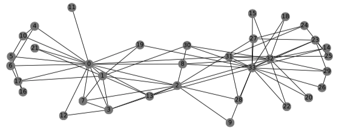

>Graph Representation Learning是GraphSAGE第一作者William Hamilton的新书，下载地址https://www.cs.mcgill.ca/~wlh/grl_book/files/GRL_Book.pdf

# Introduction

>本章首先介绍了图这种数据结构，然后介绍了基于图的机器学习。

图是一种无处不在的数据结构，是一种描述复杂系统的通用语言。一般来说，图只是对象（如节点）的集合，以及这些对象之间的交互（如边）。例如，要讲社交网络编码为图，我们可以使用节点来表示个人，使用边来表示两人是朋友（如图1.1所示）。

图1.1
